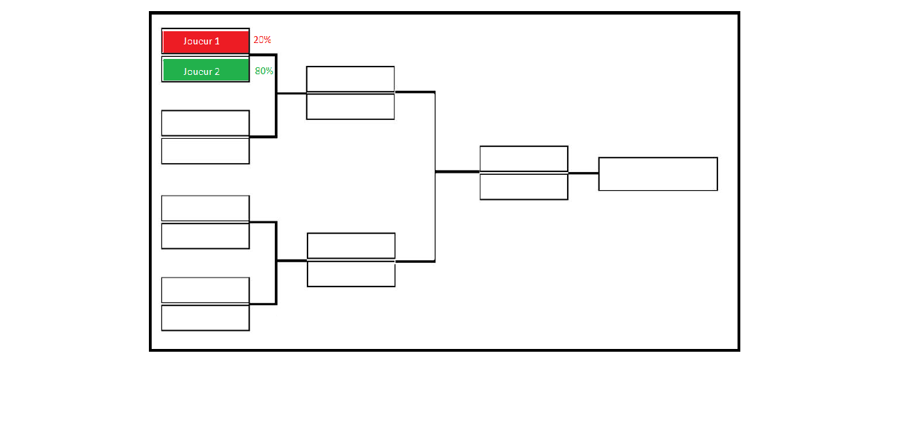

# Alex LEFEVRE  
# Damien BUKUDJIAN  
08/09/20   
      
## Idée de projet :     
     
Association de tennis. Application de prévision de résultats des tournois.    
Contient une base de données des joueurs et de leur historique ainsi que leurs caractéristiques. L'algorithme calculera le pourcentage de chance de victoire de chaque joueur pour chaque match ainsi que du tournoi en fonction de ses matchs précédents.   
    
Un profil : Administrateur    
    
De base un utilisateur est visiteur, s'il choisit de se connecter un bouton liant à une fenêtre d'administration apparait.

L'utilisateur pourra faire des simulations de tournois avec les joueurs de son choix ou des tournois disponibles.   
    
L'administrateur pourra aussi ajouter de nouveaux joueurs et rentrer les résultats des tournois passés.

Plusieurs méthodes de calculs seront mis à disposition, une simple, peu gourmande en ressource et une plus poussée et donc plus précise mais plus gourmande en ressources.
      
